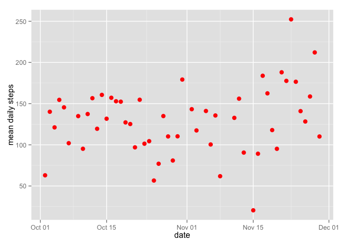

# Reproducible Research: Peer Assessment 1


```r
library(graphics)
library(ggplot2)
library(plyr)
```

## Loading and preprocessing the data


```r
myPA_data <- read.csv("activity.csv", colClasses = c("integer", "Date", "integer"))
```
"Data is for 0ctober & November 2011, sampled in 5 minute intervals. There are 288 of these 5 minute intervals per day, for a total of 288*(31+30) = 17568 intervals."


```r
myPA_processed <- myPA_data[myPA_data$steps > 0,]
```

"Only 6554 of the intervals have number of steps > 0"

## What is mean total number of steps taken per day?


```r
summary(myPA_processed$steps)
```

```
##    Min. 1st Qu.  Median    Mean 3rd Qu.    Max.    NA's 
##       1      25      56     134     147     806    2304
```

```r
the_mean <- summary(myPA_processed$steps)[4]
the_mean2 <- mean(myPA_processed$steps, na.rm = TRUE)
print("The mean total number of steps per day is  ") ; as.character(the_mean)
```

```
## [1] "The mean total number of steps per day is  "
```

```
## [1] "134"
```


```r
day_totals <- ddply(myPA_processed, ~date, function(df)sum(df$steps))
hist(day_totals$V1)
```

 

# Compute sample mean and standard deviation in each year group


```r
myPA_Summary <- ddply(myPA_processed, .(date), summarise, 
                       mean_daily_steps = mean(steps), sd = sd(steps))
hist(myPA_Summary[,2])
```

 

## What is the average daily activity pattern?

#### Plot


```r
# Use ggplot2
thisplot <- ggplot(myPA_Summary, aes(x = date, y = mean_daily_steps,)) +
        geom_point(data = myPA_Summary, aes(y = mean_daily_steps), colour = 'red', size = 3) +
        xlab("date") +
        ylab("mean daily steps")
        ggtitle("Summary")
```

```
## $title
## [1] "Summary"
## 
## attr(,"class")
## [1] "labels"
```

```r
print(thisplot)
```

```
## Warning: Removed 1 rows containing missing values (geom_point).
```

 


## Imputing missing values


## Are there differences in activity patterns between weekdays and weekends?
